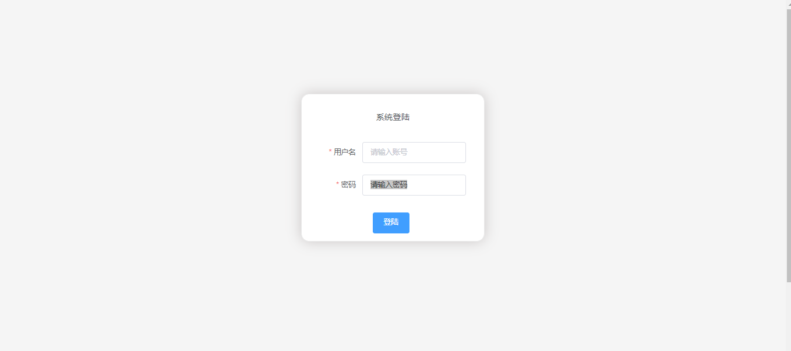
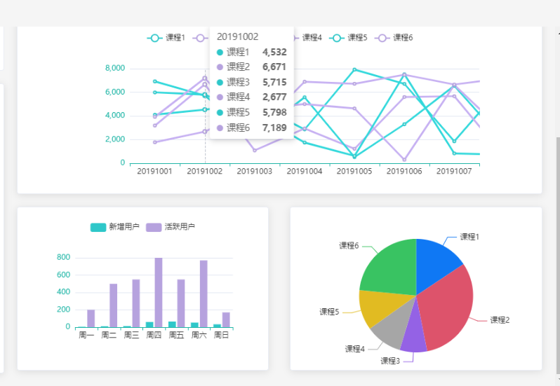
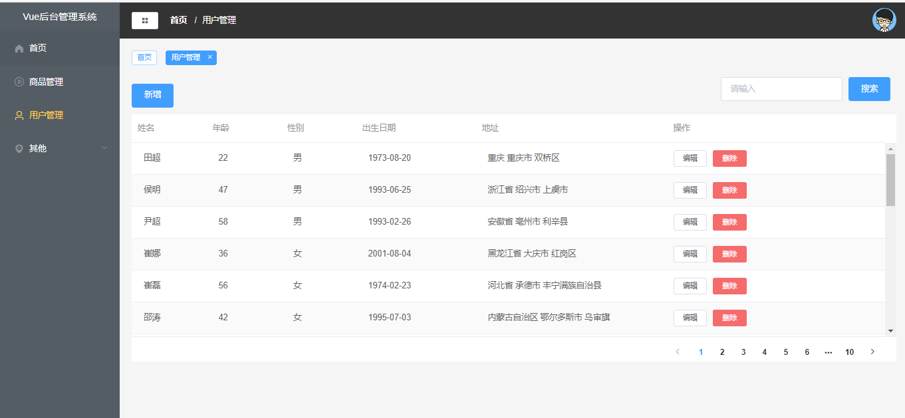
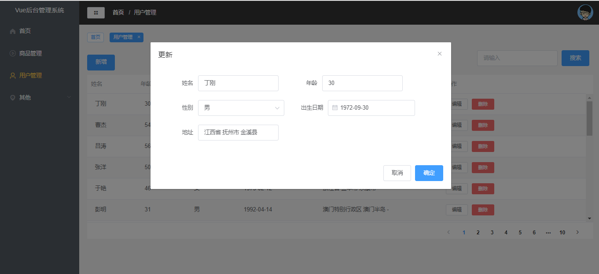

# vue2.0+elementui的后台管理系统

#### 介绍
模仿的一个后台管理系统,目前实现了登录退出模块、用户的增删改模块、数据可视化模块，商品管理和其他待补充

技术架构：Vue2.0+Vue-Router+Vuex+axios+ElementUI+mock+ECharts

### 技术要点：

1.通过Vue脚手架和ElementUI搭建项目，使用组件化模式进行开发，提高开发率

2.使用mock模拟数据和axios配合后端进行数据请求

3、引入 Vuex模块实现状态管理，实现侧边栏的跨组件传值

4、利用导航守卫建立登录权限校验，根据权限不同渲染不同的菜单栏

5、Vue-Router配置路由，实现组件间页面跳转

6、引入ECharts实现可视化并封装ECharts，减少代码冗余

#### 使用说明

1.  删除node_modules和package-lock
2.  打开cmd运行npm install
3.  在vscode终端运行 npm run dev

### 界面截图：

登录页面
（管理员和普通用户所看到的侧边栏内容是不同的）

管理员的侧边栏

普通用户侧边栏

可视化数据

用户管理界面

编辑用户
